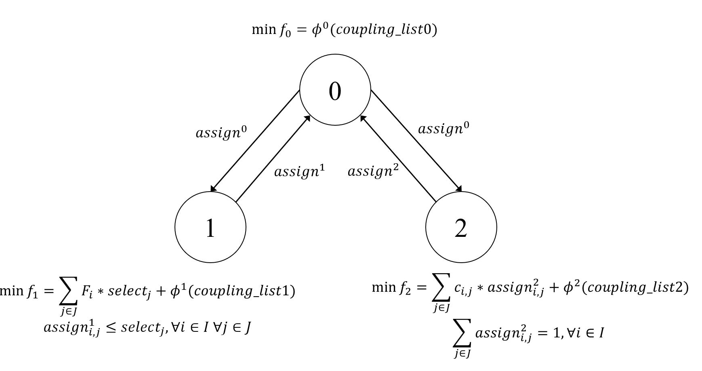
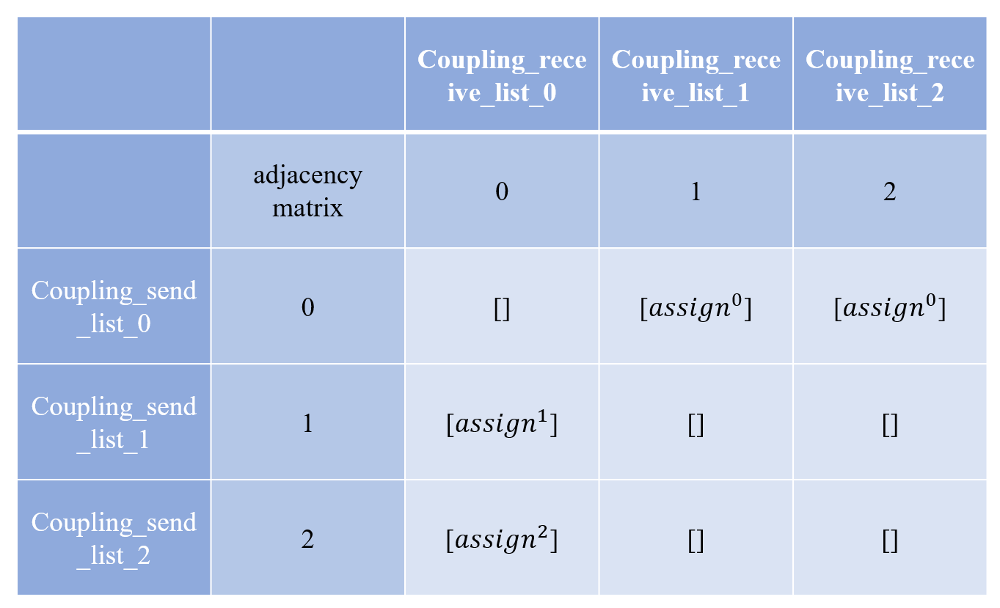

# General-Augmented-Lagrangian-Coordination
## Introduction
Augmented Lagrangian Coordination (ALC) is a distributed coordination method between decision-making nodes, in which each decision-making node/unit possesses its own decision-making capabilities and is able to make decisions based on self-objectives and constraints (conditions), and decisions between nodes need to be coordinated in order to reach agreement and optimize the performance of the entire network. 

1. Example 1: In supply chains, information asymmetry and decentralized decision-making require coordination of planning among supply chain members in order to reach a consistent supply plan. For example, an assembly firm (decision node 0) has the decision right to select a supplier (decision node 1) to supply parts, and vice versa the supplier has the decision right to select the assembly firm to supply parts. Since their goals and constraints are different, the decisions between them are also likely to be inconsistent. The supply chain plan can be executed only when the decisions of the assembler and the supplier are consistent.
2. Example 2: Within a manufacturing enterprise, there exists a production unit (shop floor) and a logistics unit (logistics department). Usually the scheduling decisions of the production node and the path planning of the logistics unit are considered independently, i.e., their objectives and constraints are different. In order to achieve synchronized operation, the decisions of these two nodes need to be coordinated to improve the performance of the entire manufacturing process. 
3. Example 3: There are multiple structural units in an automobile, such as the frame, engine, interior, tires, etc. These structures are usually manufactured separately and then assembled in a uniform manner. Because of the separate manufacturing, there may be structural inconsistencies or functional mismatches, and therefore coordination is required in the design and manufacturing of these units to improve the performance of the entire enterprise.

ATC(Analytical target cascading) and CO(Collaborative optimization)are special examples of ALC.
## General-Augmented-Lagrangian-Coordination
This project proposes a graph-based general ALC method, capable of modeling networks or problems for arbitrary coordination structures  
## Installation instructions
1. this project runs on python environment, currently only support 310 and 38 version of python (please download in Releases), if you need other python version of the project, please contact the developer: hhn0113@outlook.com  
2. Third party libraries need to be installed for this project to run: numpy==1.24.3, gurobipy    
3. gurobipy requires a license from gurobi, which can be requested from the gurobi website: https://www.gurobi.com/academia/academic-program-and-licenses/    
## Features and Advantages
1. simple operation, only need to input the adjacency matrix and the decision model of each decision node to realize
2. arbitrary coordination order
3. Bidirectional and unidirectional coordination relationships
4. multiple coordination algorithms
5. unified modeling framework
## Principle
1. This project gives a simple ALC for facility siting, which can be viewed in the Example description and AIO.ipynb file, the case is derived from https://github.com/Gurobi/modeling-examples  
2. This project breaks down the case into a coordination problem for three decision nodes, each decision node is modeled as shown in the three files node_0.py, node_1.py, node_2.py, and finally coordinated and optimized using the ALC coordination algorithm in the file ALC_coordination.py.  
### Project application steps
1. Draw a graph of the coordination relationships between the nodes and the coupling variables (interactive decision information), as well as the goal and constraints for each node, where the goal additionally contains an inconsistency penalty, and where the input for the inconsistency penalty is a list (coupling_receive_list), which is given in the next step.    

2. Write the adjacency matrix based on the coordination relationship graph, where coupling_send_list_i of decision node i is the ith row of the adjacency matrix and coupling_receive_list_i is the ith column of the adjacency matrix  

3. Write the above coupling_send_list_i and coupling_receive_list_i according to the template corresponding to node_i.py  
4. Fine tune the ALC_coordination.py file and run it! 
## Application Notes
1. currently this project only supports decision making and solving for decision nodes under Gurobi solver, in the future we will develop decision making for nodes under heuristic algorithms    
2. currently only support python version 310 and 38 (please download from Releases), if you need other python version of the project, please contact the developer: hhn0113@outlook.com  
3. If you need to improve the algorithm and explore the solution and results in depth, please feel free to contact me to discuss.
## Authors and Contributors
Hainan Huang, Email：hhn0113@outlook.com
## Future open source
There are some unpublished papers and results, and the source code will be opened after these results are published.
## Diary of major updates
20240718: Fixed the problem of inconsistency computation being computed differently at different nodes, and fixed the problem of false inconsistency computation when jumping out of the inner loop into the outer loop, which doubles the speed of ALC coordination.
20240716: Added multiple coordination modes (bi-directional, uni-directional, and composite), and support for modifying the initial values of coupling variables.  
20240715: fixed the problem of judgment error in the coordination algorithm ALC_ORGIN.  
20240712: open source part of the code of run_alc, and support to modify the initial value of the multiplier. 

## 引言
Augmented Lagrangian Coordination(ALC) 是一种决策节点之间的协调方法，其中每个决策节点/单元拥有自己的决策能力，能够根据自我目标和约束(条件)做出决策，而节点之间的决策需要进行协调以达成一致和优化整个网络的性能。  

1. 例子1：在供应链中，信息不对称、决策分散的供应链成员之间需要进行计划结果的协调，以达成一致的供应计划。例如：装配企业(决策节点0)有决策权选择供应商(决策节点1)来提供零部件，反之供应商也有决策权选择装配企业来供应零部件。由于它们的目标和约束不同，因此他们之间的决策也很可能会出现不一致。只有装配企业和供应商的决策达成一致的时候，供应链计划才能执行。  
2. 例子2：在一个制造企业内部，存在生产单元(车间)和物流单元(物流部门)。通常生产节点的调度决策和物流单元的路径规划是独立考虑的，即他们的目标和约束是不同的，为达到同步运行的效果，这两个节点的决策需要协调，以提高整个制造过程的性能。  
3. 例子3：一辆汽车存在多个结构单元，例如车架、发动机、内饰、轮胎等，这些结构通常是分开制造然后统一装配的，由于分开制造，他们之间可能会存在结构的不一致性或功能的不匹配，因此在设计和制造这些单元的时候就要协调以提高整个企业的性能。

ATC(Analytical target cascading)、CO(Collaborative optimization)都是ALC的特殊例子.
## 通用ALC
本项目提出了一种通用化的ALC方法，该方法基于图理论构建，能够针对任意协调结构和关系的网络或问题构建  

想学习ALC原理的同学可以联系我，我尽全力帮助大家学会
## 安装说明
1. 本项目运行在python环境上，目前只支持310和38版本的python(请在Releases下载)，如果需要其他python版本的项目，请联系开发者：hhn0113@outlook.com  
2. 本项目运行需要安装第三方库：  
numpy==1.24.3, gurobipy  
3. 其中需要gurobi的许可，许可可在gurobi官网申请：https://www.gurobi.com/academia/academic-program-and-licenses/  
## 特点和优势
1. 操作简单，只需要输入邻接矩阵和每个决策节点的决策模型即可实现，不需要实现协调原理
2. 任意协调顺序，本项目可以实现任意协调顺序的无缝切换
3. 双向和单向的协调关系，本项目统一了单向或双向或任意的协调关系，而原有的ALC只能实现双向协调
4. 多种协调算法
5. 统一的建模框架，本项目提供了任意决策节点统一的建模框架
## 原理
本项目给出了一个简单的设施选址的ALC，可以查看Example description and AIO.ipynb 文件，该案例源于https://github.com/Gurobi/modeling-examples  
本项目将该案例分解为三个决策节点的协调问题，每个决策节点的模型如node_0.py、node_1.py、node_2.py三个文件所示，最后采用ALC_coordination.py文件的ALC协调算法进行协调和优化  
代码中都给出了详细的注释，对于非自定义的模块请不要改动  
### 项目应用步骤
1. 画出节点间的协调关系图以及其中耦合的变量(交互的决策信息)，以及每个节点的目标和约束，其中目标额外包含一个不一致性惩罚，其中不一致性惩罚的输入是一个列表(coupling_receive_list), 该列表由下一步骤给出  

3. 根据协调关系图写出邻接矩阵，其中决策节点i的coupling_send_list_i就是邻接矩阵第i行，coupling_receive_list_i是邻接矩阵第i列  

5. 将上述coupling_send_list_i和coupling_receive_list_i按照模板写入node_i.py对应的地方  
6. 微调ALC_coordination.py文件，运行即可  
## 应用注意事项
1. 目前本项目只支持Gurobi求解器下的决策节点的决策和求解，未来将开发启发式算法下的节点决策  
2. 目前只支持310和38版本的python(请在Releases下载)，如果需要其他python版本的项目，请联系开发者：hhn0113@outlook.com  
3. 需要改进算法和深入的求解和结果探索的朋友，非常欢迎联系我一同探讨。
## 未来进一步工作
1. 接入ea库来支持启发式
2. 扩展未不确定的ALC模型，例如鲁棒优化、分布鲁棒优化、随机规划
## 作者和贡献者
黄海南(Hainan Huang)，Email：hhn0113@outlook.com
## 未来开源设想
目前有一些论文和成果未发表，在这些成果发表后将开放源代码
## 重大更新日记
20240718：修复了不一致性计算在不同节点计算不同问题，修复了跳出内循环进入外循环的假性不一致性计算问题，使得ALC协调速度翻倍。
20240716：新增了多种协调模式(双向、单向和复合)、支持修改耦合变量的初始值  
20240715：修复了协调算法ALC_ORGIN中判断错误问题。  
20240712：开源了run_alc的部分代码，并且支持修改乘子的初始值。 
