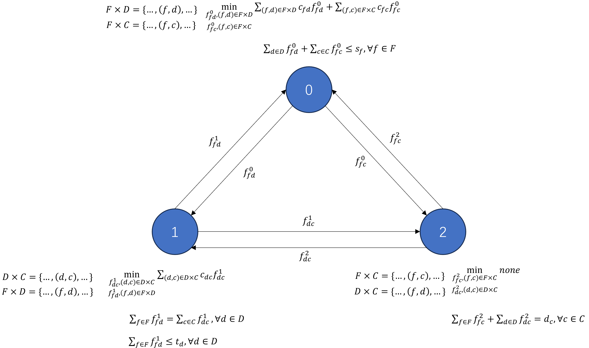
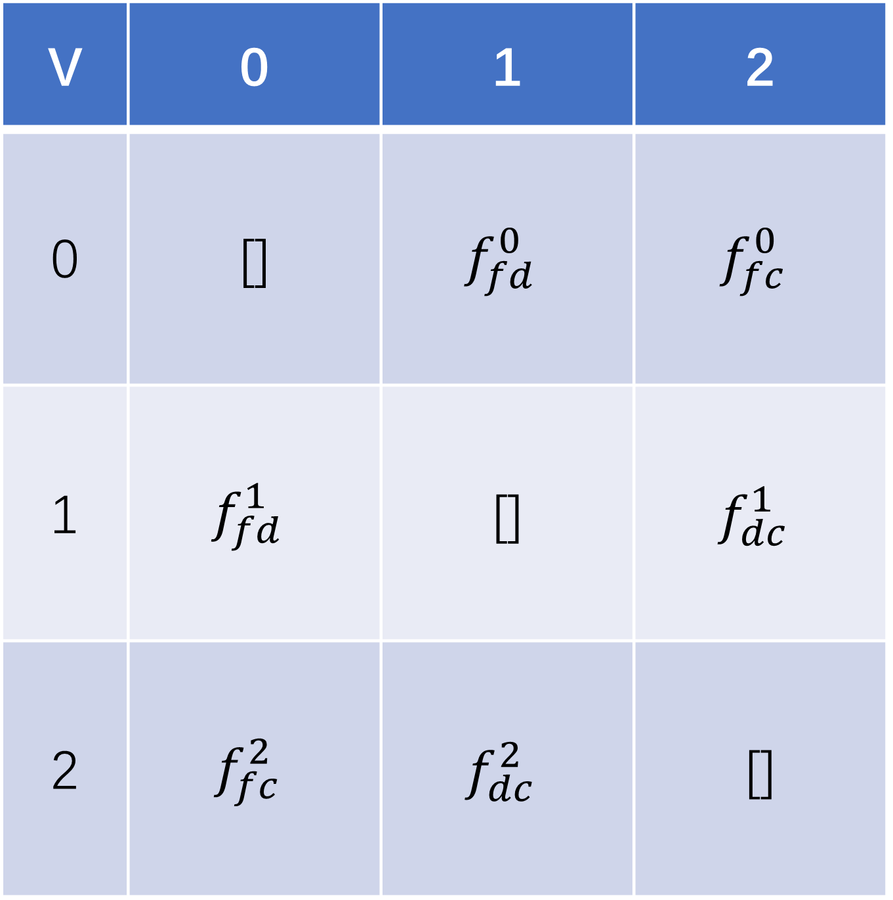

# General-Augmented-Lagrangian-Coordination

## Principle
1. This project gives a simple ALC for facility siting, which can be viewed in the Example description and AIO.ipynb file, the case is derived from https://github.com/Gurobi/modeling-examples  
2. This project breaks down the case into a coordination problem for three decision nodes, each decision node is modeled as shown in the three files node_0.py, node_1.py, node_2.py, and finally coordinated and optimized using the ALC coordination algorithm in the file ALC_coordination.py.  
### Project application steps
1. Draw a graph of the coordination relationships between the nodes and the coupling variables (interactive decision information), as well as the goal and constraints for each node, where the goal additionally contains an inconsistency penalty, and where the input for the inconsistency penalty is a list (coupling_receive_list), which is given in the next step.    

2. Write the adjacency matrix based on the coordination relationship graph, where coupling_send_list_i of decision node i is the ith row of the adjacency matrix and coupling_receive_list_i is the ith column of the adjacency matrix  

3. Write the above coupling_send_list_i and coupling_receive_list_i according to the template corresponding to node_i.py  
4. Fine tune the ALC_coordination.py file and run it! 

## Authors and Contributors
Hainan Huang, Email：hhn0113@outlook.com  
Yuting Pei, Email：1149015019@qq.com
## Future open source
There are some unpublished papers and results, and the source code will be opened after these results are published.
## Diary of major updates
20240718: Fixed the problem of inconsistency computation being computed differently at different nodes, and fixed the problem of false inconsistency computation when jumping out of the inner loop into the outer loop, which doubles the speed of ALC coordination.
20240716: Added multiple coordination modes (bi-directional, uni-directional, and composite), and support for modifying the initial values of coupling variables.  
20240715: fixed the problem of judgment error in the coordination algorithm ALC_ORGIN.  
20240712: open source part of the code of run_alc, and support to modify the initial value of the multiplier. 

## 原理
本项目给出了一个简单的设施选址的ALC，可以查看Example description and AIO.ipynb 文件，该案例源于https://github.com/Gurobi/modeling-examples  
本项目将该案例分解为三个决策节点的协调问题，每个决策节点的模型如node_0.py、node_1.py、node_2.py三个文件所示，最后采用ALC_coordination.py文件的ALC协调算法进行协调和优化  
代码中都给出了详细的注释，对于非自定义的模块请不要改动  
### 项目应用步骤
1. 画出节点间的协调关系图以及其中耦合的变量(交互的决策信息)，以及每个节点的目标和约束，其中目标额外包含一个不一致性惩罚，其中不一致性惩罚的输入是一个列表(coupling_receive_list), 该列表由下一步骤给出  

3. 根据协调关系图写出邻接矩阵，其中决策节点i的coupling_send_list_i就是邻接矩阵第i行，coupling_receive_list_i是邻接矩阵第i列  

5. 将上述coupling_send_list_i和coupling_receive_list_i按照模板写入node_i.py对应的地方  
6. 微调ALC_coordination.py文件，运行即可  

## 作者和贡献者
黄海南(Hainan Huang), Email：hhn0113@outlook.com  
裴雨婷(Yuting Pei), Email：1149015019@qq.com

